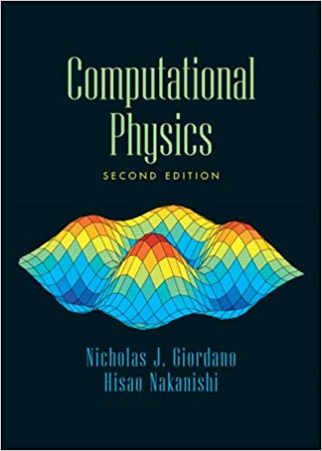
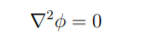
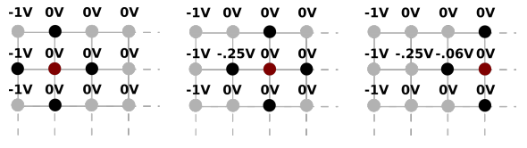
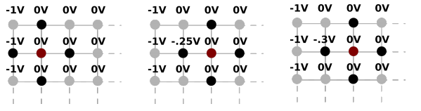
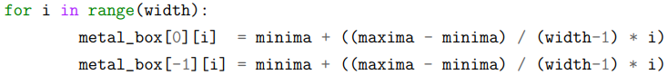
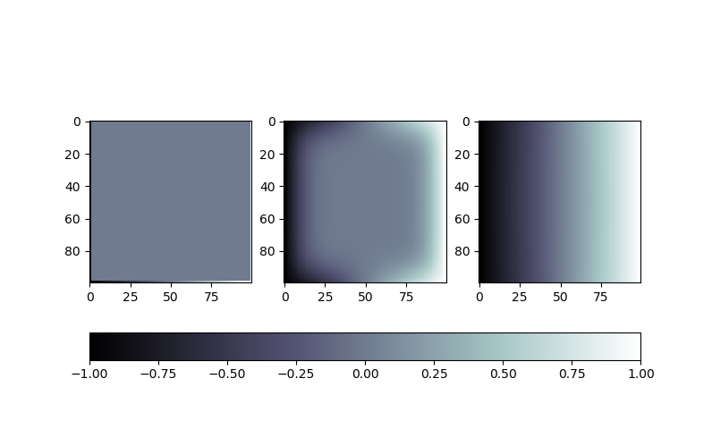
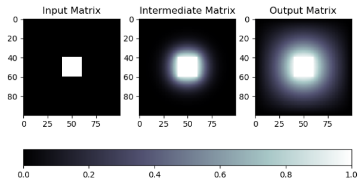
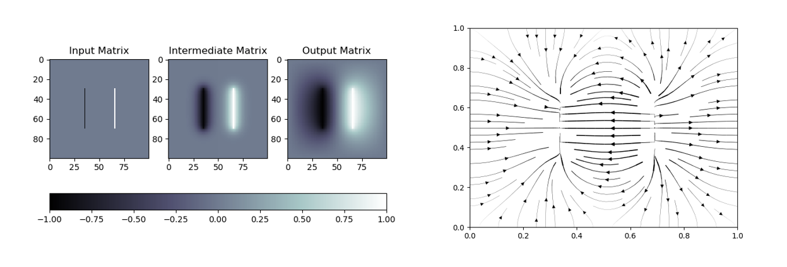
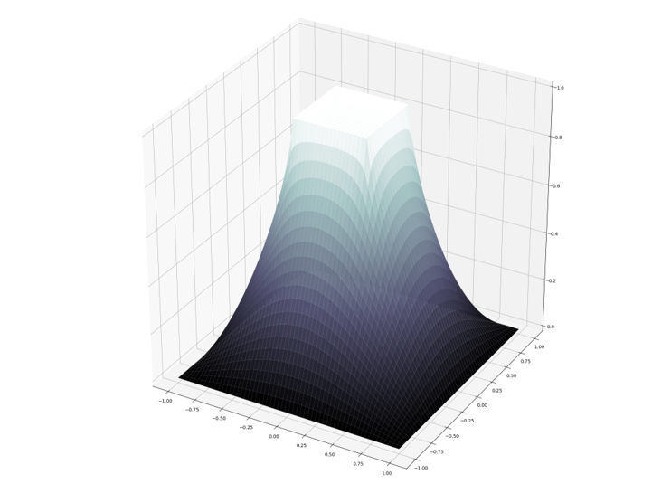
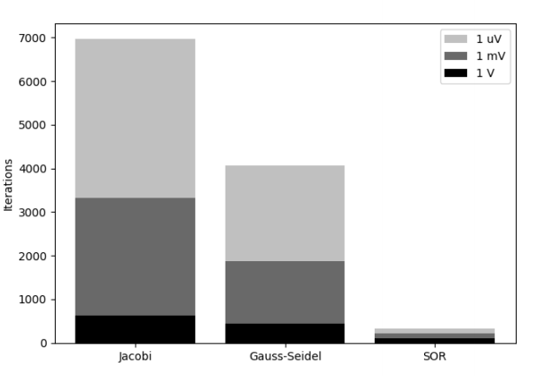

## Introduction

The solution of the Laplace equation for a given electrostatic geometry can be used to model the distribution of potential in a general way. There is one restriction: there must be a boundary in the geometry that you're testing and all the maxima and minima points (max and min potential) must be located at the boundary points. 

This repo will focus on three iterative relaxation methods: 
* Jacobian Relaxation
* Gauss-Seidel Relaxation (GS)
* Successive Over Relaxation (SOR)

Most of the work here was heavily inspired by "Computational Physics" book by Giordano and Nakanishi. 

### Laplace Equation

Laplace equation models the electric potential of regions with no electric charge. It can be used to model a wide variety of objects such as metal prisms, wires, capacitors, inductors and lightning rods. 

Laplace equation is a special case of Poisson’s equation. 

Poisson’s equation has a wide range of applications in physics and engineering. It can be used to model gravity, fluid dynamics, steady-state heat transfer and electrostatics. Poisson’s equation is important because it is at the core of this project and, in the words of Richard Feynman, “The entire subject of electrostatics, from a mathematical point of view, is merely a study of the solutions of the single equation [Poisson’s Equation].” http://www.feynmanlectures.caltech.edu/II_06.html

### The 3 Methods
In all 3 methods, the matrix is updated one-by-one from top left to bottom right. The three methods differ in how each point is updated. A delta v value is set. This is the sum of differences between the old potential points and the new. The smaller the delta v value, the more accurate your solution is.   

Jacobi method is very simple. Have two matrices. In matrix one, loop through all the elements and get the average of the neighbouring points for each matrix element. These values are then updated in the second matrix, not the first. Then the first matrix is set to equal the second matrix. This is done until delta v is below a predefined treshold.  

GS uses the same matrix to store and update the values. I drew an example of 2 GS iterations with Inksapce below. 

SOR simply multiplies the value received by GS by alpha where alpha is between 1 and 2. Below is an example of 1 SOR iteration. In this example, alpha is equal to 1.2. 

### The 3 Geographies 
The 3 methods were tested using three different geographies that were described in the book: 
* Metal Box 
* Prism 
* Capacitor 

#### Metal Box
The metal box has the leftmost and rightmost columns set as the boundaries, so -1 and +1 V in this case. 

The top and bottom were described as non-conducting, so a voltage drop equation was implemented to calculate the potential. 

Below is the metal box geometry being solved by Jacobi method. Note that all three methods will have the same output. Left side is the input and right side is the output. Middle side is how the potential is distributed after a few iterations.

#### Prism
Personally, I found the "Prism" name a bit confusing since it is usually associated with a triangular shape. In this case, the prism is just a box within a box. It is infinite in the Z axis, so it can be reduce to a 2 dimensional problem. I created an illustration of this geometry, shown here below:

Below I illustrate the growth of potential of a simple prism. 

#### Capacitor
There's not much to say about the capacitor geography. It is simply two lines in the middle of the matrix. The right side in the image below is the voltage of the geometry.

## Visualization 
You can see both the potential and voltage solutions for the three methods. I also included a "3DVideo" folder which contains code for creating a video of the prism geometry being solved.

## Convergence
In terms of iterations to convergence, SOR clearly wins. The difference also seems to grow the more precise you want your solution to be.

